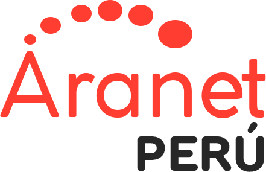

  

<strong>Universidad Peruana de Ciencias Aplicadas</strong>

<strong>Ingeniería de Software</strong> 
Aplicaciones Web  
<strong>Profesor:</strong> Velásquez Núñez, Ángel Augusto 

<h2 align="center">INFORME</h2>
<h2 align="center">2026 - 10</h2>

<h3 align="center">Startup: FreshGuard</h3>
<h3 align="center">1ASI0730-2610-10215</h3>

<strong>Producto: ColdTrack</strong>

<h3 align="center">Team Members:</h3>

| **Member**                           | **Code**     |
|--------------------------------------|--------------|
|Eslander Celis Berrospi      |  U201911249  |
|Gabriel Mendoza Palacios     |  U202416908  |
|         |  U |
|        |  U |
|        |  U  |

<strong>Abril 2026</strong>

# Registro de Versiones del Informe
| Versión | Fecha       | Autor(es)                                                              | Descripción                                                                                                                                         |
|---------|-------------|------------------------------------------------------------------------|-----------------------------------------------------------------------------------------------------------------------------------------------------|
| 0.1     | 30/04/2026  | Eslander Celis Berrospi        | Desarrollo del capítulo I: Introducción                                                                                                             |
| 0.2     | 30/04/2026  | Gabriel Mendoza Palacios        | Desarrollo del capítulo II                                                                                  |

# Project Report Collaboration Insights
Link del repositorio: 

Insights TB1 (Todos participaron):

  

  

## Contenido

* [Registro de Versiones del Informe](#registro-de-versiones-del-informe)

* [Project Report Collaboration Insights](#project-report-collaboration-insights)

* [Student Outcome](#student-outcome)

* [Capitulo I: Introducción](#capitulo-i-introducción)

  * [1.1. Startup Profile](#11-startup-profile)

    * [1.1.1. Descripcion de la Startup](#111-descripcion-de-la-startup)
    * [1.1.2. Perfiles de integrantes del equipo](#112-perfiles-de-integrantes-del-equipo)
  * [1.2. Solution Profile](#12-solution-profile)

    * [1.2.1. Antecedentes y problematica](#121-antecedentes-y-problematica)
    * [1.2.2. Lean UX Process](#122-lean-ux-process)

      * [1.2.2.1. Lean UX Problem Statements](#1221-lean-ux-problem-statements)
      * [1.2.2.2. Lean UX Assumptions](#1222-lean-ux-assumptions)
      * [1.2.2.3. Lean UX Hypothesis Statements](#1223-lean-ux-hypothesis-statements)
      * [1.2.2.4. Lean UX Canvas](#1224-lean-ux-canvas)
  * [1.3. Segmentos Objetivo](#13-segmentos-objetivo)

    * [Segmento Objetivo 1: Estudiantes Universitarios](#segmento-objetivo-1-estudiantes-universitarios)
    * [Segmento Objetivo 2: Profesores Universitarios](#segmento-objetivo-2-profesores-universitarios)

* [Capitulo II: Requirements Elicitation & Analysis](#capitulo-ii-requirements-elicitation--analysis)

  * [2.1. Competidores](#21-competidores)

    * [2.1.1. Analisis competitivo](#211-analisis-competitivo)
    * [2.1.2. Estrategias y tacticas frente a competidores](#212-estrategias-y-tacticas-frente-a-competidores)
  * [2.2. Entrevistas](#22-entrevistas)

    * [2.2.1. Diseno de entrevistas](#221-diseno-de-entrevistas)
    * [2.2.2. Registro de entrevistas](#222-registro-de-entrevistas)
    * [2.2.3. Analisis de entrevistas](#223-analisis-de-entrevistas)
  * [2.3. Needfinding](#23-needfinding)

    * [2.3.1. User Personas](#231-user-personas)
    * [2.3.2. User Task Matrix](#232-user-task-matrix)
    * [2.3.3. User Journey Mapping](#233-user-journey-mapping)
    * [2.3.4. Empathy Mapping](#234-empathy-mapping)
    * [2.3.5. As-is Scenario Mapping](#235-as-is-scenario-mapping)
  * [2.4. Ubiquitous Language](#24-ubiquitous-language)

* [Capitulo III: Requirements specification](#capitulo-iii-requirements-specification)

  * [3.1. To-Be Scenario Mapping](#31-to-be-scenario-mapping)
  * [3.2. User Stories](#32-user-stories)
  * [3.3. Impact Mapping](#33-impact-mapping)
  * [3.4. Product Backlog](#34-product-backlog)

* [Capitulo IV: Product Design](#capitulo-iv-product-design)

  * [4.1. Style Guidelines](#41-style-guidelines)

    * [4.1.1. General Style Guidelines](#411-general-style-guidelines)
    * [4.1.2. Web Style Guidelines](#412-web-style-guidelines)
  * [4.2. Information Architecture](#42-information-architecture)

    * [4.2.1. Organization Systems](#421-organization-systems)
    * [4.2.2. Labeling Systems](#422-labeling-systems)
    * [4.2.3. SEO Tags and Meta Tags](#423-seo-tags-and-meta-tags)
    * [4.2.4. Searching Systems](#424-searching-systems)
    * [4.2.5. Navigation Systems](#425-navigation-systems)
  * [4.3. Landing Page UI Design](#43-landing-page-ui-design)

    * [4.3.1. Landing Page Wireframe](#431-landing-page-wireframe)
    * [4.3.2. Landing Page Mock-up](#432-landing-page-mock-up)
  * [4.4. Web Applications UX/UI Design](#44-web-applications-uxui-design)

    * [4.4.1. Web Applications Wireframes](#441-web-applications-wireframes)
    * [4.4.2. Web Applications Wireflow Diagrams](#442-web-applications-wireflow-diagrams)
    * [4.4.2. Web Applications Mock-ups](#442-web-applications-mock-ups)
    * [4.4.3. Web Applications User Flow Diagrams](#443-web-applications-user-flow-diagrams)
  * [4.5. Web Applications Prototyping](#45-web-applications-prototyping)
  * [4.6. Domain-Driven Software Architecture](#46-domain-driven-software-architecture)

    * [4.6.1. Software Architecture Context Diagram](#461-software-architecture-context-diagram)
    * [4.6.2. Software Architecture Container Diagrams](#462-software-architecture-container-diagrams)
    * [4.6.3. Software Architecture Components Diagrams](#463-software-architecture-components-diagrams)
  * [4.7. Software Object-Oriented Design](#47-software-object-oriented-design)

    * [4.7.1. Class Diagrams](#471-class-diagrams)
    * [4.7.2. Class Dictionary](#472-class-dictionary)
  * [4.8. Database Design](#48-database-design)

    * [4.8.1. Database Diagram](#481-database-diagram)

* [Capitulo V: Product Implementation, Validation & Deployment](#capitulo-v-product-implementation-validation--deployment)

  * [5.1. Software Configuration Management](#51-software-configuration-management)

    * [5.1.1. Software Development Environment Configuration](#511-software-development-environment-configuration)
    * [5.1.2. Source Code Management](#512-source-code-management)
    * [5.1.3. Source Code Style Guide & Conventions](#513-source-code-style-guide--conventions)

      * [HTML](#html)
      * [CSS](#css)
      * [JavaScript](#javascript)
      * [TypeScript](#typescript)
      * [Java](#java)
      * [Gherkin Conventions for Readable Specifications](#gherkin-conventions-for-readable-specifications)
      * [Angular Coding Style Guide](#angular-coding-style-guide)
      * [Spring Boot Features](#spring-boot-features)
    * [5.1.4. Software Deployment Configuration](#514-software-deployment-configuration)

      * [Despliegue de la Landing Page en GitHub Pages](#despliegue-de-la-landing-page-en-github-pages)
      * [Consideraciones previas al despliegue](#consideraciones-previas-al-despliegue)
      * [Pasos de despliegue](#pasos-de-despliegue)
      * [Despliegue de la Frontend Web Application en Vercel](#despliegue-de-la-frontend-web-application-en-vercel)
      * [Despliegue de los Web Services (Backend) en Azure](#despliegue-de-los-web-services-backend-en-azure)

  * [5.2. Landing Page, Services & Applications Implementation](#52-landing-page-services--applications-implementation)

    * [5.2.1. Sprint 1](#521-sprint-1)

      * [5.2.1.1. Sprint Planning 1](#5211-sprint-planning-1)
      * [5.2.1.2. Aspect Leaders and Collaborators](#5212-aspect-leaders-and-collaborators)
      * [5.2.1.3. Sprint Backlog 1](#5213-sprint-backlog-1)
      * [5.2.1.4. Development Evidence for Sprint Review](#5214-development-evidence-for-sprint-review)
      * [5.2.1.5. Execution Evidence for Sprint Review](#5215-execution-evidence-for-sprint-review)
      * [5.2.1.6. Services Documentation Evidence for Sprint Review](#5216-services-documentation-evidence-for-sprint-review)
      * [5.2.1.7. Software Deployment Evidence for Sprint Review](#5217-software-deployment-evidence-for-sprint-review)
      * [5.2.1.8. Team Collaboration Insights during Sprint](#5218-team-collaboration-insights-during-sprint)

# Student Outcome

# Student Outcome

| **Criterio específico** | **Acciones realizadas** | **Conclusiones** |
|-------------------------|--------------------------|------------------|
| Comunica oralmente con efectividad a diferentes rangos de audiencia. | **Eslander Celis Berrospi (TB1):** aaaaaaaaaaaaaaaaaaaaaaaaaaaaaaaaaaaaaaaaaaaaaaaaaaaa.  **Gabriel Mendoza Palacios  (TB1):** aaaaaaaaaaaaaaaaaaaaaaaaaaaaaaaaaaaaaaaaaaaaaaaaa.| aaaaaaaaaaaaaaaaaaaaaaaaaaaaaaaaaaaaaaaaaaaaaaaaaaaaaaaaaa |
| Comunica por escrito con efectividad a diferentes rangos de audiencia. | **Eslander Celis Berrospi (TB1):** aaaaaaaaaaaaaaaaaaaaaaaaaaaaaaaaaaaaaaaaaaaaaaaaaaaa.  **Gabriel Mendoza Palacios  (TB1):** aaaaaaaaaaaaaaaaaaaaaaaaaaaaaaaaaaaaaaaaaaaaaaaaa.| aaaaaaaaaaaaaaaaaaaaaaaaaaaaaaaaaaaaaaaaaaaaaaaaaaaaaaaaaa |

# Project: 
# Capitulo I: Introduccion

## 1.1. Startup Profile

### 1.1.1. Descripcion de la Startup
FreshGuard Technologies es una startup tecnológica enfocada en optimizar la calidad de los alimentos durante su transporte mediante el uso de tecnología de monitoreo en tiempo real. Su producto principal, ColdTrack, es una aplicación que se integra con sensores de temperatura y humedad instalados en las unidades de transporte, permitiendo a las empresas supervisar las condiciones de los productos desde los centros de distribución hasta su destino final. A través de esta solución, los usuarios pueden visualizar datos en tiempo real, recibir alertas ante variaciones críticas y acceder a un registro histórico de cada envío. De esta manera, FreshGuard Technologies busca reducir pérdidas, mejorar la eficiencia logística y garantizar que los alimentos lleguen en condiciones óptimas al consumidor.

- **Nombre de la startup:** FreshGuard Technologies

- **Producto:** ColdTrack

- **Misión:**
Nuestra misión es garantizar la calidad y seguridad de los alimentos durante su transporte mediante el uso de tecnología de monitoreo en tiempo real, permitiendo a las empresas tomar decisiones rápidas y efectivas para evitar pérdidas y asegurar condiciones óptimas.

- **Visión:**
Nuestra visión es convertirnos en la solución líder en monitoreo de condiciones de transporte de alimentos en Perú y Latinoamérica, destacando por nuestra innovación, confiabilidad y aporte a la seguridad alimentaria.

- **Valores:**
Responsabilidad, innovación y confiabilidad.

### 1.1.2. Perfiles de integrantes del equipo

<table border="1" cellspacing="0" cellpadding="8">
  <tr>
   <td style="text-align: center" align="center">
        

         Eslander Celis Berrospi - U201911249 
          
         
         

        </td>
        <td style="text-align: center" align="center">
         Soy Eslander, estudiante de Ingeniería de Software. Me considero una persona responsable y comprometida con mis objetivos, con una gran disposición para aprender y mejorar de manera continua. Valoro mucho la ética y el trabajo en equipo, aportando siempre ideas y soluciones para alcanzar resultados de calidad. Me esfuerzo por mantener un enfoque ordenado en mis tareas y contribuir activamente al desarrollo colectivo. Tengo conocimientos en Python, C++ y HTML, lo que me permite desarrollar soluciones tecnológicas y fortalecer mis habilidades en programación. Estoy motivado a seguir aprendiendo y asumir nuevos retos que me ayuden a crecer tanto profesional como personalmente.
        </td>
       
  </tr>
  <tr>
    <td style="text-align: center" align="center">
        

        Gabriel Mendoza Palacios - U202416908
          
         
         

        </td>
        <td style="text-align: center" align="center">
         Soy estudiante de Ingeniería de Software con interes en seguir desarrollando mis habilidades de manera constante. Suelo trabajar de forma ordenada y cumplir con mis responsabilidades, aportando en entornos colaborativos. Tengo conocimientos en C++ y Python, que utilizo para resolver problemas y entender mejor el desarrollo de software. Busco seguir aprendiendo a través de nuevos retos y experiencias que me permitan crecer tanto a nivel académico como profesional.
        </td>
       
  </tr>
  

</table>

## 1.2. Solution Profile
ColdTrack es una plataforma digital diseñada para monitorear en tiempo real las condiciones de temperatura y humedad durante el transporte de alimentos, asegurando que estos se mantengan dentro de los rangos adecuados desde los centros de distribución hasta su destino final. El sistema se integra con sensores instalados en las unidades de transporte, los cuales envían datos constantemente a la aplicación, permitiendo a los usuarios visualizar el estado de cada envío en todo momento.

La plataforma genera alertas automáticas cuando se detectan variaciones que podrían comprometer la calidad del producto, facilitando una rápida toma de decisiones para evitar pérdidas. Además, los usuarios pueden acceder a un historial detallado de cada transporte, lo que permite analizar el desempeño logístico y garantizar un mayor control en la cadena de distribución.

Con una interfaz intuitiva y fácil de usar, ColdTrack no solo mejora la supervisión del transporte de alimentos, sino que también incrementa la eficiencia operativa, reduce riesgos y asegura que los productos lleguen en condiciones óptimas al consumidor final.

### 1.2.1. Antecedentes y problematica

#### 1. What / ¿QUÉ?

##### ¿Cuál es el problema que se busca resolver?  
El problema es la falta de control y monitoreo en tiempo real de la temperatura y humedad durante el transporte de alimentos, lo que puede generar deterioro en los productos.

##### ¿Qué producto o servicio se propone?  
Se propone una aplicación llamada ColdTrack que permite monitorear en tiempo real las condiciones ambientales mediante sensores.

##### ¿Para qué se utiliza esta solución?  
Se utiliza para garantizar que los alimentos se mantengan en condiciones óptimas durante su traslado.

---

#### 2. When / ¿CUÁNDO?

##### ¿Cuándo ocurre el problema?  
El problema ocurre durante el transporte de alimentos desde los centros de distribución hasta su destino final.

##### ¿En qué momento del proceso es más crítico?  
Es más crítico durante trayectos largos o cuando ocurren fallas en los sistemas de refrigeración sin ser detectadas oportunamente.

---

#### 3. Where / ¿DÓNDE?

##### ¿Dónde surge el problema?  
El problema surge en el proceso logístico de distribución de alimentos, específicamente en las unidades de transporte.

##### ¿Dónde se utilizará la solución?  
La solución será utilizada en camiones y sistemas de transporte que trasladan alimentos desde centros de distribución.

---

#### 4. Who / ¿QUIÉN?

##### ¿Quiénes están involucrados en la situación?  
Están involucradas empresas distribuidoras de alimentos, operadores logísticos, conductores y el equipo de desarrollo de la startup.

##### ¿Quiénes son los usuarios del producto?  
Los usuarios principales son las empresas de distribución, supervisores logísticos y personal encargado del control de calidad.

---

#### 5. Why / ¿POR QUÉ?

##### ¿Por qué ocurre este problema?  
Ocurre debido a la falta de herramientas tecnológicas que permitan monitorear en tiempo real las condiciones ambientales durante el transporte.

##### ¿Por qué es importante resolverlo?  
Porque impacta directamente en la calidad de los alimentos, genera pérdidas económicas y puede afectar la salud de los consumidores.

---

#### 6. How / ¿CÓMO?

##### ¿Cómo se llevará a cabo la solución?  
Se implementará una aplicación conectada a sensores que registran temperatura y humedad en tiempo real.

##### ¿Cómo funcionará en la práctica?  
Los sensores enviarán datos constantemente a la app, la cual permitirá visualizar condiciones, generar alertas y almacenar un historial de cada transporte.

---

#### 7. How Much / ¿CUÁNTO?

##### ¿Cuánto impacta el problema?  
El problema puede generar pérdidas frecuentes de productos debido a condiciones inadecuadas durante el transporte.

##### ¿Cuánto costará implementar la solución?  
Para el prototipo, el costo será bajo, pero en una implementación real implicará inversión en sensores, infraestructura tecnológica y mantenimiento.

### 1.2.2. Lean UX Process

#### 1.2.2.1. Lean UX Problem Statements

#### 1.2.2.2. Lean UX Assumptions

#### 1.2.2.3. Lean UX Hypothesis Statements

#### 1.2.2.4. Lean UX Canvas

## 1.3. Segmentos Objetivo

Para ColdTrack, se identifican dos segmentos objetivo principales que utilizan la aplicación para monitorear las condiciones de temperatura y humedad durante el transporte de alimentos.

---

### Segmento Objetivo 1: Personal de Logística y Operaciones

Este segmento está compuesto por los trabajadores encargados de supervisar y gestionar el transporte de alimentos dentro de una empresa.

**Aspectos Demográficos:**

- Edad: 25 a 50 años  
- Género: Todos los géneros  
- Nivel educativo: Técnico o universitario  
- Ocupación: Personal de logística, operaciones o control de calidad  

**Aspectos Geográficos:**

- Ubicación: Perú (principalmente zonas urbanas)  
- Lugar de uso: Oficinas y centros de distribución  

**Aspectos Psicográficos:**

- Buscan tener control y visibilidad sobre los envíos.  
- Valoran herramientas que les permitan tomar decisiones rápidas.  
- Están interesados en mejorar la eficiencia del transporte.  

**Necesidades:**

- Monitorear temperatura y humedad en tiempo real.  
- Recibir alertas ante fallas.  
- Tener registro histórico de los envíos.  

**Beneficios clave:**

- Mejor control del proceso logístico.  
- Reducción de pérdidas de productos.  
- Mayor eficiencia en la operación.  

---

### Segmento Objetivo 2: Personal de Transporte

Este segmento está compuesto por las personas encargadas de trasladar los alimentos durante las rutas de distribución.

**Aspectos Demográficos:**

- Edad: 25 a 55 años  
- Género: Todos los géneros  
- Nivel educativo: Secundaria completa o técnico  
- Ocupación: Conductores o personal de transporte  

**Aspectos Geográficos:**

- Ubicación: Perú  
- Lugar de uso: Durante el transporte (en ruta)  

**Aspectos Psicográficos:**

- Se enfocan en cumplir correctamente con la entrega.  
- Prefieren herramientas simples y fáciles de usar.  
- Valoran recibir información clara y directa.  

**Necesidades:**

- Recibir alertas sobre cambios en temperatura o humedad.  
- Saber cuándo actuar ante un problema.  
- Tener acceso rápido a la información del estado del envío.  

**Beneficios clave:**

- Respuesta rápida ante fallas.  
- Mayor seguridad en el transporte.  
- Facilidad de uso durante el trabajo.  

# Capitulo II: Requirements Elicitation & Analysis

## 2.1. Competidores

### 2.1.1. Analisis competitivo

<table border="1" cellpadding="8" cellspacing="0" style="border-collapse:collapse; width:100%; font-family:Arial, sans-serif;">
    <tr>
        <th colspan="7">Competitive Analysis Landscape</th>
    </tr>
    <tr>
        <td colspan="2" rowspan="2"><strong>¿Por qué llevar a cabo este análisis?</strong></td>
        <td colspan="5">¿Cómo se posiciona nuestra startup frente a sus competidores en cuanto a propuesta de valor, tecnología, producto y estrategia?</td>
    </tr>
    <tr>
        <td colspan="5">
            Es un análisis comparativo que permite identificar fortalezas, debilidades, oportunidades y amenazas, así como entender mejor la posición de ColdTrack frente a otras soluciones de monitoreo de cadena de frío.
        </td>
    </tr>
    <tr>
        <td colspan="3"></td>
        <td style="text-align:center;">
            <strong>ColdTrack</strong> 
            
        </td>
        <td style="text-align:center;">
            <strong>TSO Mobile Perú</strong> 
            
        </td>
        <td style="text-align:center;">
            <strong>Sensitech</strong> 
            
        </td>
        <td style="text-align:center;">
            <strong>Aranet</strong> 
            
        </td>
    </tr>
    <tr>
        <td rowspan="2">Perfil</td>
        <td colspan="2">Overview</td>
        <td>Plataforma digital que monitorea temperatura y humedad en tiempo real durante el transporte de alimentos mediante sensores integrados, con alertas y registro histórico.</td>
        <td>Solución de monitoreo de flotas con sensores de temperatura y GPS para transporte en tiempo real.</td>
        <td>Plataforma global de monitoreo de cadena de frío con sensores IoT y análisis avanzado de datos.</td>
        <td>Sistema de sensores inalámbricos para monitoreo de temperatura y humedad en entornos controlados.</td>
    </tr>
    <tr>
        <td colspan="2">Ventaja competitiva ¿Qué valor ofrece a los clientes?</td>
        <td>Enfoque en transporte de alimentos, interfaz intuitiva, alertas en tiempo real y solución accesible para el mercado local.</td>
        <td>Integración con GPS y monitoreo de flotas en tiempo real.</td>
        <td>Alta precisión, tecnología avanzada y experiencia global.</td>
        <td>Implementación sencilla y sensores inalámbricos eficientes.</td>
    </tr>
    <tr>
        <td rowspan="2">Perfil de Marketing</td>
        <td colspan="2">Mercado objetivo</td>
        <td>Empresas de distribución de alimentos, operadores logísticos y supervisores de calidad.</td>
        <td>Empresas de transporte y logística en Perú.</td>
        <td>Empresas globales de logística, farmacéutica y alimentos.</td>
        <td>Empresas que requieren monitoreo ambiental (almacenes, industria).</td>
    </tr>
    <tr>
        <td colspan="2">Estrategias de marketing</td>
        <td>Enfoque en digitalización, eficiencia operativa y accesibilidad para empresas locales.</td>
        <td>Marketing B2B y soluciones integradas de flotas.</td>
        <td>Branding global, innovación tecnológica y posicionamiento premium.</td>
        <td>Marketing técnico enfocado en sensores y eficiencia.</td>
    </tr>
    <tr>
        <td rowspan="3">Perfil de Producto</td>
        <td colspan="2">Productos & Servicios.</td>
        <td>Aplicación web con monitoreo en tiempo real, alertas y registro histórico de envíos.</td>
        <td>Sistema de monitoreo con sensores y software de gestión de flotas.</td>
        <td>Dispositivos IoT + plataforma de monitoreo y análisis.</td>
        <td>Sensores inalámbricos + plataforma de monitoreo.</td>
    </tr>
    <tr>
        <td colspan="2">Precios & Costos</td>
        <td>Modelo accesible adaptable a empresas medianas y pequeñas.</td>
        <td>Costo medio-alto por implementación de hardware y software.</td>
        <td>Alto costo debido a tecnología avanzada.</td>
        <td>Costo medio dependiendo de sensores y sistema.</td>
    </tr>
    <tr>
        <td colspan="2">Canales de distribución (Web y/o Móvil)</td>
        <td>Web (escalable a móvil).</td>
        <td>Web y sistemas integrados.</td>
        <td>Web y plataformas empresariales.</td>
        <td>Web.</td>
    </tr>
    <tr>
        <td rowspan="5">Análisis SWOT</td>
    <tr>
        <td colspan="2">Fortalezas</td>
        <td>Fácil de usar, accesible, enfoque en transporte y monitoreo en tiempo real.</td>
        <td>Presencia local y monitoreo de flotas.</td>
        <td>Tecnología avanzada y reconocimiento global.</td>
        <td>Sensores precisos y fácil implementación.</td>
    </tr>
    <tr>
        <td colspan="2">Debilidades</td>
        <td>Startup nueva con baja presencia en el mercado.</td>
        <td>Enfoque técnico y menor usabilidad.</td>
        <td>Alto costo y complejidad.</td>
        <td>Menor enfoque en transporte.</td>
    </tr>
    <tr>
        <td colspan="2">Oportunidades</td>
        <td>Crecimiento del sector logístico y necesidad de control de calidad.</td>
        <td>Expansión en el mercado peruano.</td>
        <td>Expansión tecnológica global.</td>
        <td>Mayor adopción de IoT en industrias.</td>
    </tr>
    <tr>
        <td colspan="2">Amenazas</td>
        <td>Competidores consolidados y adopción lenta del mercado.</td>
        <td>Nuevas startups más accesibles.</td>
        <td>Competencia en precios y nuevas tecnologías.</td>
        <td>Competidores enfocados en transporte.</td>
    </tr>
</table>

### 2.1.2. Estrategias y tácticas frente a competidores

Para definir el posicionamiento de **ColdTrack** frente a la competencia, se ha desarrollado la siguiente matriz FODA Cruzada.

| **FODA CRUZADO** | &nbsp; | &nbsp; |
| :--- | :--- | :--- |
| **Factores Externos** | **Oportunidades (O)** 1. Crecimiento del sector logístico en Perú. 2. Regulaciones sanitarias más estrictas. 3. Disposición de Pymes para adoptar IoT. 4. Alianzas con gremios de transportistas. | **Amenazas (A)** 1. Competidores globales consolidados (Sensitech). 2. Resistencia al cambio tecnológico en conductores. 3. Competencia por precios bajos de sensores genéricos. 4. Inestabilidad de red móvil en zonas rurales. |
| **Fortalezas (F)** 1. Especialización exclusiva en alimentos. 2. Interfaz minimalista de fácil uso. 3. Costos reducidos para Pymes. 4. Soporte técnico local y personalizado. | **Estrategia (FO) — Ofensivas** • **FO1 (F1, O2):** Posicionar a ColdTrack como el aliado para cumplir normativas sanitarias locales. • **FO2 (F3, O3):** Capturar el mercado de Pymes con planes de suscripción accesibles. • **FO3 (F2, O1):** Facilitar adopción en nuevas flotas con una interfaz sin fricciones técnicas. | **Estrategia (FA) — Defensivas** • **FA1 (F1, A1):** Diferenciarse de generalistas destacando nuestro enfoque en la merma de alimentos. • **FA2 (F2, A2):** Vencer la resistencia tecnológica con una app que facilite el trabajo del conductor. • **FA3 (F4, A3):** Competir contra hardware genérico ofreciendo servicio post-venta local. |
| **Debilidades (D)** 1. Marca nueva con poca presencia. 2. Recursos limitados frente a corporaciones. 3. Dependencia de red en tiempo real. 4. Equipo de ventas reducido. | **Estrategia (DO) — Reorientación** • **DO1 (D1, O4):** Ganar credibilidad rápida mediante convenios con asociaciones de transportistas. • **DO2 (D3, O3):** Implementar almacenamiento offline en la app para sincronizar datos al recuperar señal. • **DO3 (D4, O1):** Automatizar captación de clientes con marketing digital hiper-segmentado. | **Estrategia (DA) — Supervivencia** • **DA1 (D2, A1):** Dominar nichos locales (ej. lácteos) antes de competir en licitaciones masivas. • **DA2 (D1, A3):** Crear casos de éxito locales para generar confianza frente a opciones baratas. • **DA3 (D3, A4):** Optimizar la app para que funcione con bajo consumo de datos en zonas rurales. |

## 2.2. Entrevistas

### 2.2.1. Diseno de entrevistas

<h4 id="Segment">Segmento objetivo: Personal de Logística y Operaciones</h4> 

<h4 id="PreguntPersonal">Preguntas Personales:</h4> 

¿Cuál es su nombre?

¿Cuál es su edad?

¿Cuál es su cargo o rol exacto dentro de la empresa?

¿Cuántos años de experiencia tiene en el sector logístico o control de calidad de alimentos?

---

<h4 id="PreguntEspe">Preguntas específicas:</h4> 

¿Cómo gestionan actualmente el monitoreo de temperatura y humedad en sus unidades de transporte?

¿Qué tipo de herramientas o sistemas utilizan en su día a día para este control (termómetros manuales, dataloggers, hojas de Excel, software)?

¿Cuáles son los principales problemas o frustraciones que enfrenta para garantizar que no se rompa la cadena de frío?

¿Ha tenido problemas recientes de pérdida de productos por fallas en la refrigeración que no se detectaron a tiempo?

¿Qué tan rápido pueden reaccionar actualmente frente a una emergencia de temperatura en medio de una ruta?

¿Qué información o métricas le resultaría más urgente visualizar en una plataforma en tiempo real?

¿Estaría dispuesto a implementar una nueva solución tecnológica si esta no requiere una instalación compleja de hardware?

¿Qué funcionalidades considera indispensables para que su equipo confíe en esta nueva plataforma?

---

<h4 id="Segment">Segmento objetivo: Personal de Transporte (Conductores)</h4> 

<h4 id="PreguntPersonal">Preguntas Personales:</h4> 

¿Cuál es su nombre?

¿Cuál es su edad?

¿Cuántos años de experiencia tiene manejando vehículos de transporte de carga refrigerada?

¿Qué tipo de alimentos perecibles suele transportar con mayor frecuencia?

---

<h4 id="PreguntEspe">Preguntas específicas:</h4> 

Durante un viaje, ¿cómo verifica actualmente que la temperatura de la cámara frigorífica se mantenga en los niveles correctos?

¿Qué tipo de aplicaciones móviles utiliza en su celular para facilitar su trabajo diario (GPS, WhatsApp, apps de la empresa)?

¿Cuáles son los principales problemas que enfrenta en la ruta respecto al cuidado de la carga?

¿Alguna vez se le ha dañado la mercadería por un cambio de temperatura que no notó a tiempo? ¿Cómo ocurrió?

Cuando ocurre una falla técnica con la refrigeración lejos de la base, ¿cuál es el protocolo que debe seguir?

¿Suele transitar por zonas donde la señal de internet o celular es inestable? ¿Cómo maneja la comunicación en esos casos?

Si tuviera una app que le avise de problemas con la temperatura, ¿cómo le gustaría que sea la alarma para que no lo distraiga mientras maneja?

¿Qué tendría que tener esta aplicación para que sienta que le ayuda en su trabajo y no que lo está complicando?

### 2.2.2. Registro de entrevistas

### 2.2.3. Analisis de entrevistas

## 2.3. Needfinding

### 2.3.1. User Personas

### 2.3.2. User Task Matrix

### 2.3.3. User Journey Mapping

### 2.3.4. Empathy Mapping

### 2.3.5. As-is Scenario Mapping

## 2.4. Ubiquitous Language

# Capitulo III: Requirements Specification

## 3.1. To-Be Scenario Mapping

## 3.2. User Stories

### Epics

| Epic ID | Título                     | Descripción                                                                                                          |
| ------- | -------------------------- | -------------------------------------------------------------------------------------------------------------------- |
| EP-001  | Gestión de Usuarios        | Permite el registro, autenticación y gestión de perfiles según tipo de usuario (Logística u Operador de Transporte). |
| EP-002  | Gestión de Envíos          | Permite crear, visualizar y administrar los envíos monitoreados.                                                     |
| EP-003  | Monitoreo en Tiempo Real   | Permite visualizar temperatura y humedad en tiempo real mediante sensores.                                           |
| EP-004  | Alertas y Notificaciones   | Genera alertas automáticas ante condiciones críticas.                                                                |
| EP-005  | Landing Page e Información | Presenta información del sistema, contacto, testimonios y suscripción.                                               |

### User Stories + Technical Stories

| ID | Título | Descripción | Criterios de Aceptación | Epic |
|----|--------|-------------|--------------------------|------|
| US-001 | Registro de usuario | Como usuario, quiero registrarme seleccionando mi rol para acceder al sistema. | - Escenario 1: Registro como personal de logística Dado que un usuario accede al formulario de registro Cuando completa todos los datos correctamente y selecciona el rol “Logística” Entonces el sistema registra su cuenta exitosamente Y le permite acceder a funcionalidades de supervisión  - Escenario 2: Registro como personal de transporte Dado que un usuario accede al formulario de registro Cuando completa todos los datos correctamente y selecciona el rol “Transporte” Entonces el sistema registra su cuenta exitosamente Y le permite acceder a funcionalidades en ruta | EP-001 |
| US-002 | Inicio de sesión | Como usuario, quiero iniciar sesión para acceder a mi cuenta. | - Escenario 1: Inicio exitoso Dado que el usuario está registrado en el sistema Cuando ingresa sus credenciales correctamente Entonces el sistema valida la información Y permite el acceso al panel principal  - Escenario 2: Credenciales incorrectas Dado que el usuario ingresa datos inválidos Cuando intenta iniciar sesión Entonces el sistema muestra un mensaje de error Y bloquea el acceso | EP-001 |
| US-003 | Recuperar contraseña | Como usuario, quiero recuperar mi contraseña. | - Escenario 1: Recuperación exitosa Dado que el usuario olvidó su contraseña Cuando ingresa su correo registrado Entonces el sistema envía un enlace de recuperación Y le permite restablecer su contraseña  - Escenario 2: Correo inválido Dado que el correo no está registrado Cuando intenta recuperar su contraseña Entonces el sistema muestra un mensaje de error | EP-001 |
| TS-001 | Crear usuario | Como developer, quiero registrar usuarios en BD. | - Escenario 1: Creación exitosa Dado que se reciben datos válidos Cuando se procesa la solicitud de registro Entonces el sistema guarda el usuario en la base de datos Y retorna una respuesta exitosa  - Escenario 2: Datos inválidos Dado que faltan campos obligatorios Cuando se procesa la solicitud Entonces el sistema rechaza la operación Y retorna un error | EP-001 |
| TS-002 | Autenticación | Como developer, quiero validar login. | - Escenario 1: Autenticación válida Dado que las credenciales coinciden con un usuario registrado Cuando se realiza la validación Entonces el sistema genera un token de acceso válido  - Escenario 2: Autenticación inválida Dado que las credenciales no coinciden Cuando se intenta autenticar Entonces el sistema retorna un error de acceso | EP-001 |
| US-004 | Crear envío | Como personal de logística, quiero registrar un envío. | - Escenario 1: Registro exitoso Dado que el usuario completa todos los campos requeridos Cuando registra el envío Entonces el sistema guarda la información correctamente Y el envío aparece en la lista de envíos activos  - Escenario 2: Datos incompletos Dado que faltan campos obligatorios Cuando intenta registrar el envío Entonces el sistema muestra errores de validación Y no permite el registro | EP-002 |
| US-005 | Ver envíos | Como usuario, quiero visualizar envíos activos. | - Escenario 1: Lista disponible Dado que existen envíos registrados Cuando accede a la sección de envíos Entonces el sistema muestra la lista completa de envíos activos  - Escenario 2: Lista vacía Dado que no existen envíos registrados Cuando accede a la sección Entonces el sistema muestra un mensaje indicando que no hay registros | EP-002 |
| US-006 | Ver detalle | Como usuario, quiero ver detalles del envío. | - Escenario 1: Visualización correcta Dado que el usuario selecciona un envío Cuando accede al detalle Entonces el sistema muestra temperatura, humedad y estado del envío  - Escenario 2: Error de carga Dado que ocurre un fallo en el sistema Cuando intenta visualizar el detalle Entonces el sistema muestra un mensaje de error | EP-002 |
| TS-003 | CRUD envíos | Como developer, quiero gestionar envíos. | - Escenario 1: Consulta exitosa Dado que existen envíos en la base de datos Cuando se realiza una consulta Entonces el sistema retorna la lista correctamente  - Escenario 2: Error interno Dado que ocurre un fallo en el servidor Cuando se realiza la consulta Entonces el sistema retorna un error | EP-002 |
| US-007 | Asignar sensor | Como logística, quiero vincular sensores. | - Escenario 1: Asignación correcta Dado que el usuario selecciona un sensor válido Cuando lo vincula al envío Entonces el sistema asocia correctamente el sensor  - Escenario 2: Sensor inválido Dado que el sensor no existe o no está disponible Cuando intenta vincularlo Entonces el sistema muestra un error | EP-002 |
| US-008 | Finalizar envío | Como logística, quiero cerrar un envío. | - Escenario 1: Finalización exitosa Dado que el envío ha terminado Cuando el usuario lo finaliza Entonces el sistema cambia su estado a completado Y lo envía al historial  - Escenario 2: Error en cierre Dado que ocurre un fallo Cuando intenta finalizar el envío Entonces el sistema no guarda los cambios | EP-002 |
| TS-004 | Asignación sensor | Como developer, quiero vincular sensores. | - Escenario 1: Asignación válida Dado que el sensor existe Cuando se realiza la vinculación Entonces el sistema lo asocia correctamente al envío  - Escenario 2: Error Dado que el sensor no es válido Cuando se intenta asignar Entonces el sistema retorna error | EP-002 |
| US-009 | Ver temperatura | Como usuario, quiero visualizar temperatura. | - Escenario 1: Datos en tiempo real Dado que el sensor está activo Cuando el usuario accede al monitoreo Entonces el sistema muestra la temperatura actualizada  - Escenario 2: Sin conexión Dado que el sensor no envía datos Cuando accede al monitoreo Entonces el sistema muestra una advertencia | EP-003 |
| US-010 | Ver humedad | Como usuario, quiero visualizar humedad. | - Escenario 1: Visualización correcta Dado que el sensor está funcionando correctamente Cuando el usuario accede al monitoreo Entonces el sistema muestra el porcentaje de humedad actualizado  - Escenario 2: Error de sensor Dado que el sensor no envía datos Cuando accede al monitoreo Entonces el sistema muestra una alerta de error | EP-003 |
| US-011 | Estado del envío | Como usuario, quiero ver estado general. | - Escenario 1: Estado normal Dado que las condiciones están dentro del rango Cuando el sistema evalúa los datos Entonces muestra un estado óptimo  - Escenario 2: Estado crítico Dado que los valores están fuera de rango Cuando el sistema evalúa los datos Entonces muestra un estado de alerta | EP-003 |
| US-012 | Gráficos | Como usuario, quiero ver gráficos históricos. | - Escenario 1: Datos disponibles Dado que existen registros Cuando accede a los gráficos Entonces el sistema muestra la información visual  - Escenario 2: Sin datos Dado que no existen registros Cuando accede Entonces el sistema muestra un mensaje informativo | EP-003 |
| TS-005 | Integración IoT | Como developer, quiero recibir datos. | - Escenario 1: Recepción válida Dado que el sensor envía datos correctamente Cuando el sistema los recibe Entonces los almacena en la base de datos  - Escenario 2: Datos inválidos Dado que los datos están corruptos Cuando se reciben Entonces el sistema los descarta | EP-003 |
| TS-006 | Tiempo real | Como developer, quiero usar WebSockets. | - Escenario 1: Conexión activa Dado que la conexión está establecida Cuando llegan nuevos datos Entonces el sistema actualiza la información en tiempo real  - Escenario 2: Desconexión Dado que se pierde la conexión Cuando el sistema lo detecta Entonces intenta reconectar automáticamente | EP-003 |
| US-013 | Alertas temperatura | Como usuario, quiero recibir alertas. | - Escenario 1: Alerta generada Dado que la temperatura supera los límites establecidos Cuando el sistema detecta la anomalía Entonces genera una alerta Y notifica al usuario  - Escenario 2: Condición normal Dado que los valores están dentro del rango Cuando se monitorea el envío Entonces no se genera ninguna alerta | EP-004 |
| US-014 | Notificación conductor | Como transporte, quiero alertas inmediatas. | - Escenario 1: Recepción correcta Dado que se genera una alerta Cuando el sistema envía la notificación Entonces el conductor la recibe en su dispositivo  - Escenario 2: Sin conexión Dado que el dispositivo no tiene conexión Cuando se genera la alerta Entonces el sistema la almacena y la envía posteriormente | EP-004 |
| US-015 | Historial alertas | Como usuario, quiero ver alertas pasadas. | - Escenario 1: Registros disponibles Dado que existen alertas registradas Cuando accede al historial Entonces el sistema muestra la lista  - Escenario 2: Sin registros Dado que no existen alertas Cuando accede Entonces el sistema muestra un mensaje vacío | EP-004 |
| TS-007 | Motor alertas | Como developer, quiero detectar anomalías. | - Escenario 1: Detección de error Dado que un valor está fuera del rango permitido Cuando el sistema analiza los datos Entonces genera una alerta  - Escenario 2: Sin anomalías Dado que los valores son correctos Cuando se analizan Entonces no se ejecuta ninguna acción | EP-004 |
| TS-008 | Notificaciones | Como developer, quiero enviar alertas. | - Escenario 1: Envío exitoso Dado que existe una alerta Cuando se envía la notificación Entonces el usuario la recibe correctamente  - Escenario 2: Error de envío Dado que ocurre un fallo Cuando se intenta enviar Entonces el sistema reintenta el envío | EP-004 |
| US-016 | Ver historial | Como usuario, quiero revisar historial. | - Escenario 1: Historial disponible Dado que existen registros Cuando accede al historial Entonces el sistema muestra los envíos  - Escenario 2: Sin historial Dado que no existen registros Cuando accede Entonces el sistema muestra un mensaje | EP-005 |
| US-017 | Descargar reporte | Como logística, quiero exportar reportes. | - Escenario 1: Descarga exitosa Dado que existen datos Cuando solicita el reporte Entonces el sistema genera un archivo descargable  - Escenario 2: Error Dado que ocurre un fallo Cuando solicita el reporte Entonces el sistema muestra un error | EP-005 |
| US-018 | Filtrar historial | Como usuario, quiero filtrar datos. | - Escenario 1: Filtro aplicado Dado que el usuario selecciona criterios Cuando aplica el filtro Entonces el sistema muestra resultados filtrados  - Escenario 2: Sin coincidencias Dado que no hay resultados Cuando aplica el filtro Entonces el sistema muestra mensaje | EP-005 |
| TS-009 | Guardar historial | Como developer, quiero persistir datos. | - Escenario 1: Guardado correcto Dado que existen datos válidos Cuando se almacenan Entonces se guardan correctamente  - Escenario 2: Error Dado que ocurre un fallo Cuando se intenta guardar Entonces se registra el error | EP-005 |
| TS-010 | Exportar PDF | Como developer, quiero generar reportes. | - Escenario 1: Generación exitosa Dado que existen datos Cuando se genera el PDF Entonces se crea correctamente  - Escenario 2: Error Dado que ocurre un fallo Cuando se genera Entonces muestra error | EP-005 |
| US-019 | Ver información | Como usuario, quiero conocer la app. | - Escenario 1: Información visible Dado que el usuario accede a la landing page Cuando navega por la página Entonces visualiza información clara sobre la aplicación  - Escenario 2: Comprensión Dado que revisa el contenido Cuando analiza la información Entonces entiende los beneficios del sistema | EP-006 |
| US-020 | Testimonios | Como usuario, quiero ver opiniones. | - Escenario 1: Visualización Dado que existen testimonios Cuando accede a la sección Entonces el sistema los muestra  - Escenario 2: Navegación Dado que hay múltiples testimonios Cuando interactúa Entonces puede cambiar entre ellos | EP-006 |
| US-021 | Contacto | Como usuario, quiero comunicarme. | - Escenario 1: Envío correcto Dado que completa el formulario Cuando envía el mensaje Entonces el sistema lo registra  - Escenario 2: Error Dado que faltan campos Cuando envía Entonces el sistema muestra errores | EP-006 |
| US-022 | Ver equipo | Como usuario, quiero ver equipo. | - Escenario 1: Visualización Dado que accede a la sección Cuando carga la página Entonces ve los integrantes del equipo  - Escenario 2: Error Dado que ocurre un fallo Cuando carga Entonces muestra mensaje alternativo | EP-006 |
| US-023 | Ver funcionalidades | Como usuario, quiero ver beneficios. | - Escenario 1: Visualización Dado que accede a la sección Cuando navega Entonces ve las funcionalidades principales  - Escenario 2: Comprensión Dado que revisa el contenido Cuando analiza la información Entonces entiende el valor del sistema | EP-006 |
| TS-011 | Formulario contacto | Como developer, quiero guardar mensajes. | - Escenario 1: Guardado correcto Dado que se envían datos válidos Cuando se procesa la solicitud Entonces se almacenan correctamente  - Escenario 2: Error Dado que los datos son inválidos Cuando se procesa Entonces se rechaza | EP-006 |
| TS-012 | Testimonios API | Como developer, quiero listar testimonios. | - Escenario 1: Datos disponibles Dado que existen testimonios Cuando se consulta la API Entonces retorna la lista  - Escenario 2: Sin datos Dado que no existen registros Cuando se consulta Entonces retorna lista vacía | EP-006 |

## 3.3. Impact Mapping

## 3.4. Product Backlog

| Prioridad | User Story ID | Título HU | Story Points |
|----------|--------------|----------|-------------|
| 1 | US-001 | Registro de usuario | 5 |
| 2 | US-002 | Inicio de sesión | 5 |
| 3 | US-004 | Crear envío | 8 |
| 4 | US-007 | Asignar sensor a envío | 8 |
| 5 | US-009 | Ver temperatura en tiempo real | 8 |
| 6 | US-010 | Ver humedad en tiempo real | 8 |
| 7 | US-013 | Alertas de temperatura | 8 |
| 8 | US-014 | Notificación al conductor | 5 |
| 9 | US-006 | Ver detalle del envío | 5 |
| 10 | US-011 | Estado del envío | 5 |
| 11 | US-005 | Ver envíos activos | 5 |
| 12 | US-008 | Finalizar envío | 5 |
| 13 | US-012 | Visualizar gráficos históricos | 8 |
| 14 | US-015 | Ver historial de alertas | 5 |
| 15 | US-016 | Ver historial de envíos | 5 |
| 16 | US-018 | Filtrar historial | 5 |
| 17 | US-003 | Recuperar contraseña | 3 |
| 18 | US-017 | Descargar reporte | 8 |
| 19 | US-019 | Ver información de la app (Landing) | 3 |
| 20 | US-020 | Ver testimonios | 3 |
| 21 | US-021 | Formulario de contacto | 3 |
| 22 | US-022 | Ver equipo de desarrollo | 2 |
| 23 | US-023 | Ver funcionalidades del sistema | 3 |
# Capitulo IV: Product Design

## 4.1. Style Guidelines

### 4.1.1. General Style Guidelines

### 4.1.2. Web Style Guidelines

## 4.2. Information Architecture

### 4.2.1. Organization Systems

### 4.2.2. Labeling Systems

### 4.2.3. SEO Tags and Meta Tags

### 4.2.4. Searching Systems

### 4.2.5. Navigation Systems

## 4.3. Landing Page UI Design

### 4.3.1. Landing Page Wireframe

### 4.3.2. Landing Page Mock-up

## 4.4. Web Applications UX/UI Design

### 4.4.1. Web Applications Wireframes

### 4.4.2. Web Applications Wireflow Diagrams

### 4.4.3. Web Applications Mock-ups

### 4.4.4. Web Applications User Flow Diagrams

## 4.5. Web Applications Prototyping

## 4.6. Domain-Driven Software Architecture

### 4.6.1. Software Architecture Context Diagram

### 4.6.2. Software Architecture Container Diagrams

### 4.6.3. Software Architecture Components Diagrams

## 4.7. Software Object-Oriented Design

### 4.7.1. Class Diagrams

### 4.7.2. Class Dictionary

## 4.8. Database Design

### 4.8.1. Database Diagram

# Capitulo V: Product Implementation, Validation & Deployment

## 5.1. Software Configuration Management

### 5.1.1. Software Development Environment Configuration

### 5.1.2. Source Code Management

### 5.1.3. Source Code Style Guide & Conventions

#### HTML

#### CSS

#### JavaScript

#### TypeScript

#### Java

#### Gherkin Conventions for Readable Specifications

#### Angular Coding Style Guide

#### Spring Boot Features

### 5.1.4. Software Deployment Configuration

#### Despliegue de la Landing Page en GitHub Pages

#### Consideraciones previas al despliegue

#### Pasos de despliegue

#### Despliegue de la Frontend Web Application en Vercel

#### Pasos de despliegue

#### Despliegue de los Web Services (Backend) en Azure

#### Pasos de despliegue

## 5.2. Landing Page, Services & Applications Implementation

### 5.2.1. Sprint 1

#### 5.2.1.1. Sprint Planning 1

#### 5.2.1.2. Aspect Leaders and Collaborators

#### 5.2.1.3. Sprint Backlog 1

#### 5.2.1.4. Development Evidence for Sprint Review

#### 5.2.1.5. Execution Evidence for Sprint Review

#### 5.2.1.6. Services Documentation Evidence for Sprint Review

#### 5.2.1.7. Software Deployment Evidence for Sprint Review

#### 5.2.1.8. Team Collaboration Insights during Sprint
